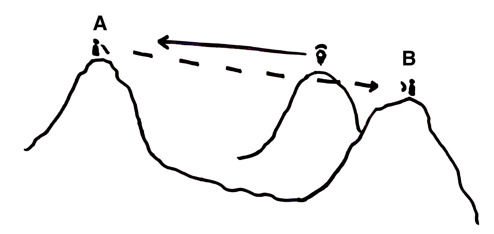
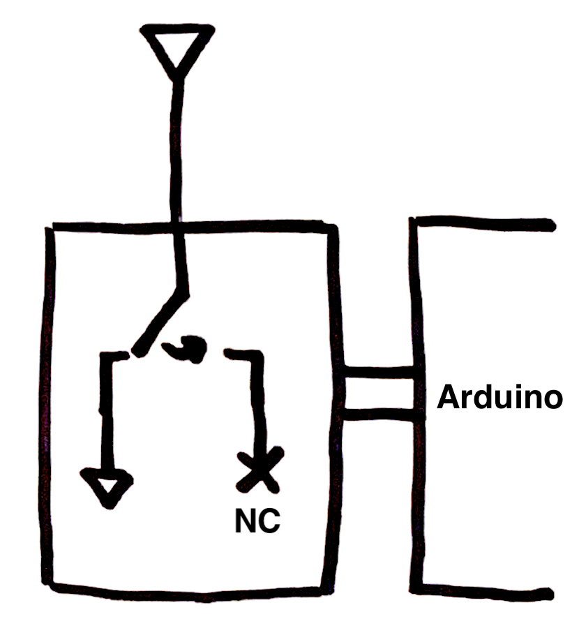
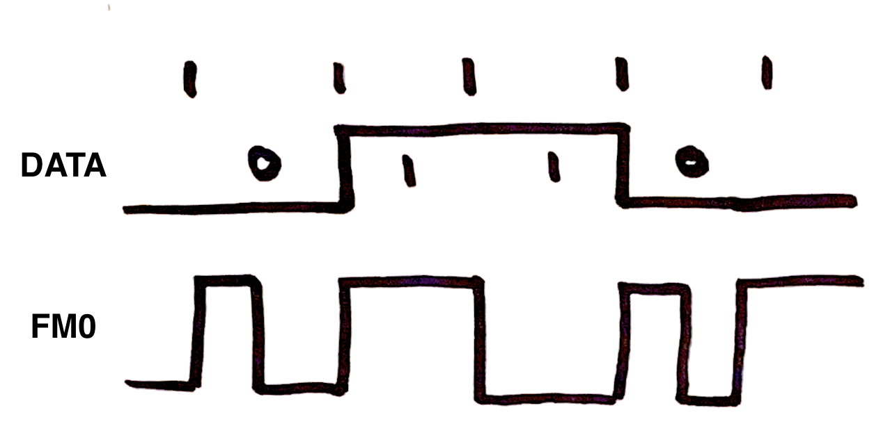

# Low-power Backscatter Sensor Communications

*NSAP Capstone Project, 2021*

Eli Baum

- topic sentences
- active voice

## Overview

Wireless communications systems require significant power and can be rather large due to the analog circuitry required to modulate radio signals. Here, we propose a method of using *backscatter technology* to build extremely low-power wireless sensors. Without the normal requirements of radio transmitters, these backscatter sensors can be small, cheap, and long-lived; furthermore, since they emit no power, they are difficult for an adversary to detect.

A backscatter transmitter modulates reflected radio signals from another source, rather than radiating signals that it generates. Since the transmitter must do nothing more than switch a transistor at a given frequency, it requires very little power: most of the power and processing requirements for communication are shifted to the signal source (or "illuminator") and receiver, which may be attached to larger ground, air, or maritime platforms, where power and size are less constrained.

Backscatter systems can also be cheaply manufactured to provide distributed sensing capabilities. Warfighters could distribute thousands of sensors across an area of interest and fly data-collection drones over the sensor field. Or, a fixed station could read data in real time from hidden sensors at a distance.

In this prototype, an SDR is used to generate a fixed-frequency tone at 915 MHz. The sensor modulates data at approximately 150 kHz; the receive side of the SDR is therefore tuned to 915.15 MHz. We attach a magnetic sensor to demonstrate one possible Sponsor-focused application. However, this demonstration is not the limit of backscatter sensing technology: academic research has demonstrated the ability for relatively complex backscatter systems to be powered entirely by harvested ambient radio frequency energy, while other studies have used custom waveforms to receive backscatter signals over distances of more than a kilometer.

## Backscatter

Backscatter communication may seem counterintuitive compared to standard wireless communication systems. The following analogy may help clarify its operation.

---

Consider two parties, Alice and Bob, who wish to communicate with each other, across some significant distance, at night. (For the purposes of argument, assume a line of sight exists between them.) The simplest method for Alice to send a message would probably be for her to point a flashlight at Bob and turn it on and off under some modulation scheme (say, Morse code). Bob could record Alice's pulses of light and translate them into a message.

However, there are several drawbacks to this system. Alice must carry a flashlight, which may be heavy, require large power supplies, and generate significant heat. Additionally, if Alice would like to communicate covertly (or is trying to hide her location), a flashlight might be too easy for an adversary to detect.

Alice comes up with an alternative scheme: she carries a mirror which she uses to carefully reflect moonlight in Bob's direction. The resulting light will be much dimmer, from Bob's perspective, but Alice no longer needs a flashlight.

Alice and Bob soon run into an issue – if the moon is not in the sky, or it is cloudy, they are unable to communicate. Seeking more reliable communication, Bob sets up a lantern at a third location; Alice can once again either reflect, or not reflect, the light from the lantern towards Bob.

<em>Alice stands on the left hill with a mirror. Bob places a lantern on the central hill, and stands on the rightmost hill.</em>

One problem remains: how can Bob see Alice's dim reflections, when the lantern is so much brighter? Perhaps Bob has a shade or lenses. However, imagine a *phosphorescent mirror*; that is, one which changes the color of reflected light. Then, Bob could filter the wavelength of light coming from his lantern; only Alice's signal will remain.

---

Many of the concepts (and compromises) discussed above apply to radio communications, as well. The final scenario – where Bob illuminates Alice's color-changing reflector and detects the return signal – closely mirrors how backscatter *radio* communications works.

In this prototype, we use an SDR as both illuminator and detector. The transmit (TX) end of the SDR broadcasts a constant-frequency cosine tone; this is similar to Bob's lantern. The analog of the mirror is an antenna connected to the RF switch, which can either reflect or attenuate the illuminating signal.

For the "color-changing" component of Alice's mirror, we take advantage of constructive interference:

Given two signals $A$ and $B$, with respective frequencies $f_A$ and $f_B$, the addition of those two signals $A+B$ will appear to have a frequency component at $f_A \pm f_B$. (This is often noted in music, where the perceived *beat frequency* can be used to tune an instrument, but we can just as easily create a frequency-shifting effect at radio frequencies.) In this prototype, the cosine illuminator is transmitted at 915 MHz ($=f_A$); the sensor module is configured to toggle the RF switch at approximately 150 kHz ($=f_B$). Therefore, we expect artifacts to appear at $915\pm0.15$ MHz. By tuning the receive (RX) side of the SDR to 915.15 MHz, and keeping its bandwidth below 300 kHz (we use 200 kHz, the minimum of our hardware), interference from the transmitter is entirely eliminiated. At this point, the reflected signal can be modulated in various ways. See *[Physical Layer](#physical-layer)*, below, for further details.

In the national security domain, backscatter was perhaps most famously used by the Soviet Union during their bugging of the American Embassy in Moscow with "[The Thing](https://en.wikipedia.org/wiki/The_Thing_(listening_device))." This project is inspired by that use case, but we consider witting, environmental sensing applications (rather than covert espionage uses) for backscatter technology.

### A Word on RFID

Some commercial radio frequency identification (RFID) systems use backscatter technology. These systems are not extensible, and provide no way to transmit sensor data, as was desired here – instead, they generally transmit a fixed identification number – but they may provide future avenues for exploration.

The most well-known of such technologies is passive RFID, commonly encountered in electronic access control systems and contactless payment. In these systems, a tag reader generates an "interrogation" signal which is then reflected, and modulated, by the tag. Often (as in the case of a badge reader), the tag contains no power supply of its own, and instead harvests power from the interrogation signal itself.

Usually, passive systems work only at sufficiently small distances where the reader and tag antennas can *magnetically couple* (on order of centimeters, and such coupling attenuates much faster); no actual radio signals are exchanged. However, some passive RFID systems *do* indeed work via radio waves in a manner similar to the backscatter communication module presented here – certain electronic toll collection systems are a common example.

Passive RFID contrasts with *active RFID*, which operates more like a normal wireless transmitter. Here, the interrogation signal "wakes up" the RFID tag, which then replies using its own dedicated transmitter. Such systems operate over greater distances, and with lower error, but of course use much more power than purely reflective systems.

## Prototype Components

The prototype backscatter sensor module consists of an Arduino (with an ATmega328 microcontroller), an RF switch, and a magnetic sensor. We take readings from the magnetic sensor, process them on the Arduino, and transmit data using backscatter.

<em>A diagram of the hardware setup. The antenna is either grounded (through a 50Ω resistor, or not connected.)</em>

### Physical Layer

The physical layer consists of the actual modulation of information onto the 915 MHz carrier wave. We chose a simple physical layer for ease of implementation and rapid prototyping.

#### Hardware

The centerpiece of this prototype is an RF switch (Minicircuits model ZX80-DR230-S+). The switch is connected to the output of one of the ATmega's timer compare outputs; the timer is configured to oscillate at approximately 150 kHz. We connect an antenna to only one of the switch's ports and leave the others disconnected.

When the switch is in the open position, the antenna is connected to the unterminated center port. Therefore, incoming RF will be reflected. When the switch is closed, the antenna is terminated with an internal 50Ω load, so all energy will be absorbed.

#### Amplitude Shift Keying

We use amplitude-shift keying (ASK) to modulate data; this is the simplest scheme that could be used for the purposes of a viable prototype. 

We experimented with frequency-shift keying (FSK) but decided not to move forward with it. FSK provides superior information density but is less noise-tolerant and more computationally complex to decode. Furthermore, the usefulness of an FSK system was limited by the granularity of the microcontroller's internal oscillator.

Other schemes, such as phase-shift keying (PSK) and quadrature amplitude modulation (QAM) were not possible with the hardware available on the sensor module. The RF switch contained a purely resistive internal load; phase-related modulations would only be possible with reactive (i.e. capacitive) loads. A fieldable backscatter solution would likely require more advanced hardware capable of these advanced modulation schemes.

#### FM0

Once we are able to modulate the signal, the next problem is to actually send bits. In particular, we need a *clock recovery* method – how do we align our receiver's data stream with that of our reflector's? In this prototype, we have used *FM0 encoding*, an extremely simple run-length limited (RLL) code. RLL codes are designed to contain sufficient transitions to enable clock recovery; without FM0, a string of identical values could be difficult to differentiate.

In fact, FM0 is quite similar to Morse code. `1` bits are encoded as a long pulse, while `0` is encoded as two short pulses (hence the "FM" or "frequency modulation" in its name). We do not care about the actual level of these pulses, but only their *transitions*: in practice, after every bit, we toggle the signal, but for a `0`, we also toggle halfway though that bit period. For example, to send the data `0110`, we encode:

    Data:   | 0| 1| 1| 0|
    Pulses:  SS  L  L SS
    TX: ...0 10 11 00 10 1...

While this is not particularly efficient (it takes 2 symbols to send one bit, making FM0 a rate-1/2 code), it is simple to implement and appropriate for prototyping.

At this point, a fieldable system would also include error-detection and correction schemes to ensure reliable communication at a distance. We implemented a Hamming encoder/decoder, but decided not include it in the final prototype, since it was unnecessary for demonstration purposes.

### Packet Layer

Various data-transmission strategies are possible; we chose continuous data transmission, since this is simple and beneficial for demonstration purposes. We designed a packet format, as follows:

    Access Code [32 bits]
        e1 5a e8 93
    Sequence number [8 bits]
        xx
    Data Length, bytes [8 bits]
        xx
    Data (8 bits per reading)
        xx xx xx ...

The access code, `0xe15ae893`, is a commonly-used non-cyclical access code with strong auto-correlation properties. This makes it easy for the decoder to synchronize to the start of the packet: the access code correlates poorly with itself at all offsets except 0.

The sequence number provides some level of error detection, however – it is incremented for each packet (overflowing from 255 to 0); the decoder only accepts a packet if the decoded sequence number is one greater than the previous.

### Sensor Demonstration

The focus of this project was on backscatter communication itself, not on the particular data sent over the backscatter link. Here, we add a magnetic sensor to the backscatter sensor, to demonstrate real-time communication capabilities. We take a moving average of the sensor readings and send 16 8-bit values per packet.

With these parameters, each packet is therefore 176 bits. At a symbol rate of 2000 baud, we can send 1000 bits per second. This gives about 5.7 packets per second, or 91 readings per second.

### Decoder Implementation

The Python decoder is implemented as a series of layers. Each layer receives data from the one above, provides some processing functionality, and passes data down.

1. SDR sampling
    
    GNURadio is used to read samples from the SDR.

2. ASK decoding

    A simple ASK decoder converts samples into binary values. Since the sampling rate is much higher than the symbol rate (by about two orders of magnitude), there are multiple digitized samples per actual ASK symbol.

3. Pulse length determination

    FM0 decoding depends on the length of pulses in the input stream. First, we perform a *coarse* search – this layer simply returns the time between binary transitions.

4. Pulse length clustering

    Due to noise and timing inaccuracies, not all pulses will be the expected short or long lengths. In this step, we cluster the received pulses around their estimated true length, and also account for noise. For example, a burst of noise in the middle of a long pulse (say, of length 2) may make that pulse look like three short pulses (say, of lengths 0.9, 0.2, and 0.9). This layer detects the noisy burst and converts the set of pulses into the correct long pulse.

5. FM0 decoding

    Now, we can turn pulses into symbols: two short pulses is a `0`; one long pulse is a `1`.

6. Packet decoding

    Each packet begins with the non-cyclical access code. We use a sliding 32-bit window, correlated against the access code, to find the start of a packet (the correlation* reaches a maximum at perfect alignment). Next, we check the sequence number, and if correct, we read the length, and then the prescribed number of data bytes.

    *\* In a later version of the prototype, we use bitwise XOR rather than statistical correlation, since this ends up producing fewer false positives.*

7. Data graphing

    Finally, data values are plotted in real time with `matplotlib`.

## Results

it works

some distance results

multiples of wavelength - nodes

## Caveats and Future Work

more robust transmission

fsk, psk

faster data rate
